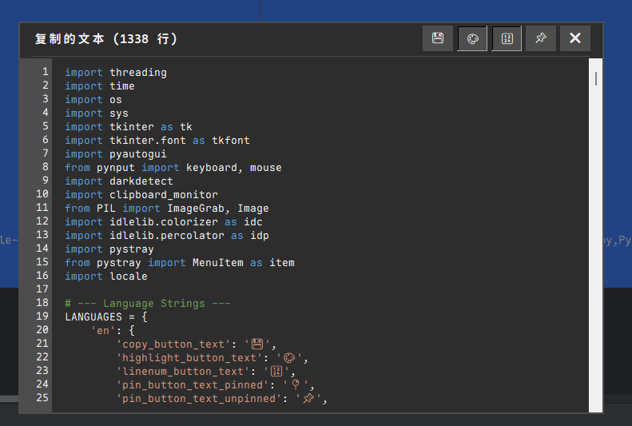

# Clipboard Helper

> *注：此README将在后续版本中进一步完善*

Clipboard Helper 是一款强大的剪贴板增强工具，旨在提升你的复制粘贴体验。它能够智能监控剪贴板变化，实时显示复制内容，并提供文本编辑、语法高亮等功能。

## ✨ 主要功能

- 🔄 **智能监控**：自动检测剪贴板变化，支持文本、文件路径和图片
- 📝 **文本编辑**：在弹出窗口中直接编辑复制的文本
- 🎨 **语法高亮**：支持代码语法高亮
- 🔢 **行号显示**：便于查看长文本内容
- 📌 **窗口钉选**：可以将窗口固定在屏幕上不自动关闭
- 🌍 **多语言支持**：目前支持英文和中文
- 🖥️ **多显示器支持**：在多显示器环境下智能定位弹窗
- 🔍 **自动调整大小**：根据内容自动设置合适的窗口大小
- 📊 **系统托盘**：最小化到系统托盘，不占用任务栏空间
- ⌨️ **快捷键支持**：使用Ctrl+Shift+Z快速查看剪贴板内容

## 📸 截图

  

*[此处添加更多应用截图]*

## 🚀 使用方法

1. **基本使用**：
   - 复制任何内容后，会自动弹出预览窗口
   - 窗口在失去焦点后约5秒自动消失（除非被钉选）

2. **快捷键**：
   - `Ctrl+Shift+Z`：随时查看当前剪贴板内容
   - `Ctrl+Enter`：将编辑后的内容复制回剪贴板

3. **窗口功能按钮**：
   - 💾 复制编辑后的内容回剪贴板
   - 🎨 切换语法高亮
   - 🔢 切换行号显示
   - 📌 钉选窗口（固定不消失）
   - ❌ 关闭窗口

4. **使用技巧**：
   - 结合Windows 10/11的`Win+V`历史剪贴板功能使用效果更佳
   - 安装项目中的字体`/fonts/MapleMonoNormalNL-NF-CN-Regular.ttf`以获得最佳显示效果

## 🛠️ 安装方法

### 预编译版本

1. 从[Releases](https://github.com/foxerine/clipboard-helper/releases)页面下载最新版本
2. 解压缩并运行`Clipboard-Helper.exe`
3. 安装`/fonts/MapleMonoNormalNL-NF-CN-Regular.ttf`字体以获得最佳体验

### 从源码运行

```bash
# 克隆仓库
git clone https://github.com/foxerine/clipboard-helper.git

# 安装依赖
pip install -r requirements.txt

# 安装字体
# 双击安装fonts文件夹中的字体文件

# 运行程序
python main.py
```

### 从源码编译

```bash
python -m nuitka --standalone --mingw64 --windows-console-mode=disable --enable-plugin=tk-inter --plugin-enable=anti-bloat --nofollow-import-to=numpy,pandas,matplotlib,scipy,PyQt5,PySide2,email,http,ssl,urllib,html,xml,test,unittest,tkinter.test,idlelib.idle_test --include-package=pynput,pyautogui,darkdetect,pystray --include-module=idlelib.colorizer,idlelib.percolator --include-data-dir=assets=assets --python-flag=-OO --remove-output --lto=yes --onefile ./main.py
```

## 🔧 系统要求

- Windows 11 (未在其他操作系统上充分测试)
- Python 3.7+ (从源码运行时)
- 依赖库：tkinter, pynput, pyautogui, darkdetect, idlelib, PIL, pystray

## 🤝 贡献

欢迎提交问题报告或功能建议！也欢迎提交代码贡献：

1. Fork 本仓库
2. 创建你的特性分支 (`git checkout -b feature/amazing-feature`)
3. 提交你的更改 (`git commit -m 'Add some amazing feature'`)
4. 推送到分支 (`git push origin feature/amazing-feature`)
5. 创建一个 Pull Request

## 📄 许可

此项目采用 [MIT 许可](LICENSE) 开源。

## 🙏 致谢

- 感谢所有的开源库作者
- 以及所有提供反馈和建议的用户
